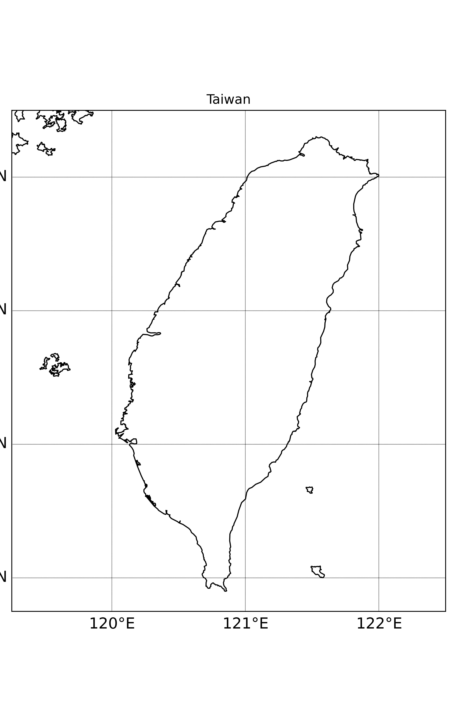

# Atmospheric-map

## Intro

This is the project that observes the varing of global temperature for the first half of 2021. 

Hope you guys enjoy!!! 

And be helpful for the one who also interested in Atmospheric Science.


## Create Enviroment
> MacOS 11.5.2
> 
> conda --version: 4.11.0
> ``` vim
> $ conda create --name atmpy38 python=3.8
> $ conda activate atmpy38
> ```

## Under atmpy37

>``` vim
> $ conda install numpy
> $ conda install matplotlib
> $ conda install -c anaconda basemap
> $ conda install -c conda-forge basemap-data-hires
> $ conda install -c conda-forge metpy
> $ conda install pandas
> $ conda install netcdf4
> $ conda install -c conda-forge cartopy
> ```

### Verify version

> ``` vim
> $ conda --version
> conda 4.11.0
> 
> $ python --version
> Python 3.7.6
> 
> $ python
> 
> >>> from mpl.toolkits.basemap import Basemap
> >>> quit()
> ```

### Steps

#### 1. Run app to generate the formal status.
> ``` vim
> $ python3 app.py
> ```


#### 2. Well done ^_^, but it still an additional try. we can try to draw a Taiwan Map.
> ``` vim
> $ python3 DrawTW.py
> ```

