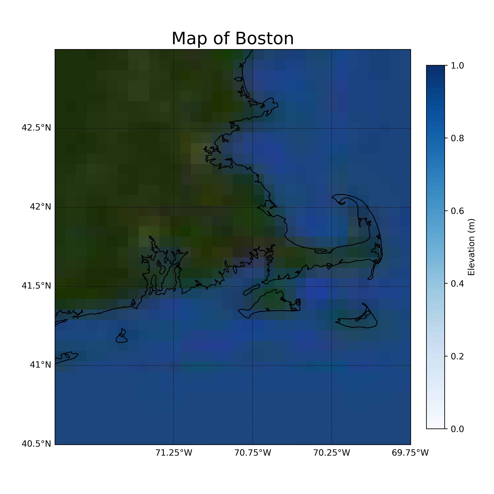
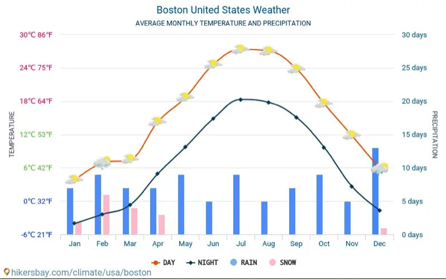
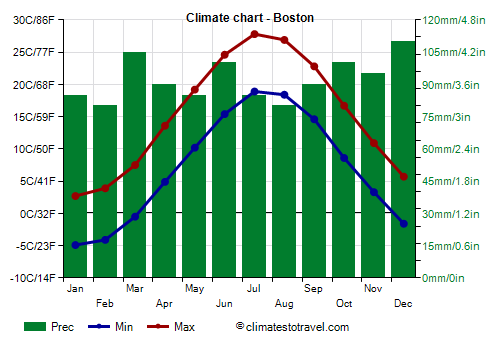
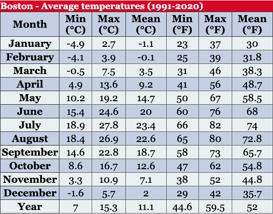
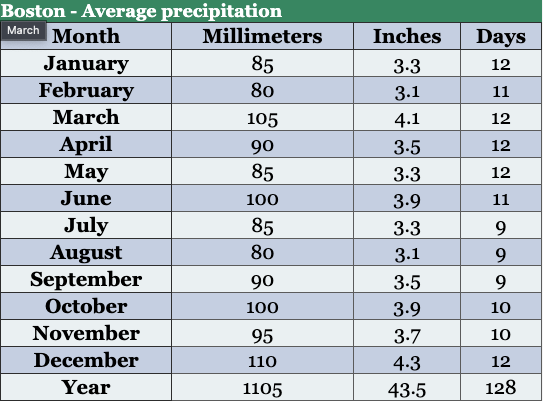
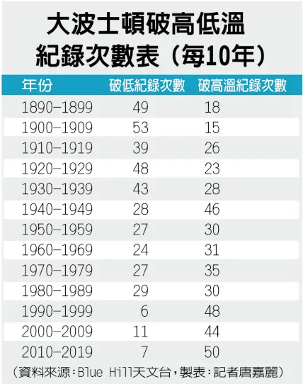

# 賀哥帶你去 Boston 🚀
##### Tags: `AP3031-氣候學`, `ATM`, `Report`, `NEU`, `Labster`, `Charles River`, `Snow`

> Student Number: 109601003  
> Dept. ATM  
> Name: 林群賀（Hugo ChunHo Lin）  
> Date: 18-MAY-2023

## 目錄
- Boston 基本介紹
- Boston 氣候樣貌介紹
- 心得總結及討論時間  
- 可以改進的內容
- 氣候學課程心得

  

## Boston 基本介紹 🦞

##### Tags: `麻州首府`, `古老城市`, `學術氣息`, `自由之路`, `靠海`, `大龍蝦`, `夏天炎熱潮濕`, `冬天冷多雪`

Boston 在美國是一座極具發展的現代化都市，位置在美國東岸的麻薩諸塞州，並且為麻州的首府，其實 Boston 可以追朔很多的歷史淵源，而且 Boston 是美國最古老的城市之一，就像我們過去課本所學習到的美國革命事件、波士頓屠殺、波士頓茶葉等許多歷史事件，如此多的事件發生以讓波士頓在現在有自由之路的名號，記載著過往歷史所發生過的痕跡，一來讓人們窺探過往的種種，了解過去發生的紀錄，另外也提醒著人們歷史事件所能汲取的告誡。  
波士頓也是一座靠近海的城市，因此有很多與沿海相關的特性，當然極具盛名的便是「波士頓大龍蝦」這種高檔的海鮮美食，同樣也是許多人前往波士頓的箇中原因。鄰近海洋的都市常常會帶有豐沛的降水，以及較佳的溫度調節效果，因此波士頓有著「夏天炎熱潮濕、冬季冷且多雪」的特徵。   
另外波士頓也是美國高等教育的重鎮，畢竟光一座城市，就有著許多世界極具盛名的高等學府，像是 Harvard、MIT、BU、NEU 等的高等學府，這邊想要岔題一下，想要分享之後出國的目標規劃是 NEU，這所大學雖然過去的名氣不高，不過最近的辦學越來越認真，以及學校資源都越來越豐富了，尤其是在 CS 相關領域，可以徜徉在更多元的學術資源，可以說是目前美國相當頂尖的水準了，我也希望自己能朝此目標持續大步向前邁進。  
描寫了這麽多波士頓相關的資訊，想要為此總結，Boston 就是一座發展程度極好的都市，並且也包有了許多人文歷史可以供人去探究、挖掘。

| My Boston Plot [[code]](https://1chooo.github.io/atmo-lab/country/draw_Boston/)  | Charles River  | Boston Common  |
| :---: | :---: | :---: |
|  | ||

|  NEU CS | Boston Museum  | Quincy Market  |
| :---: | :---: | :---: |
|  | ||

## Boston 氣候樣貌介紹 🦞

##### Tags: `中緯度`, `全年季節溫度變化明顯`, `Cyclone`, `靠海`, `夏天炎熱潮濕`, `冬天冷多雪`

波士頓位於中緯度地區，原本可能擁有大陸性氣候，但由於其鄰近港口的地理位置，波士頓的氣候表現與其他中緯度國家有所不同。該城市在冬季和夏季的溫差較大，且降雨和降雪量相對較高。這可能是由於波士頓受到中緯度地區的氣旋影響，這些氣旋通常帶有水氣，導致降雨和降雪的增加。波士頓的天氣變化多端，被全球公認為難以預測的城市之一。此外，作為一個臨海城市，波士頓的夏季炎熱潮濕且多雨，冬季則寒冷多風，且經常降下大雪。  
對於沒有經歷過下雪城市生活的人來說，波士頓的降雪現象也非常有趣。由於其位於美國東北部，常受到溫帶氣旋的影響，這解釋了降雪的原因。此外，我對於降雪有更深入的好奇，想了解是否存在更嚴重的降雪情況。因此我查閱了一些降雪記錄，通常情況下，嚴重的降雪會伴隨著中緯度氣旋或低氣壓系統。這些低氣壓系統的中心氣壓在 24 小時內下降了 24 hPa 以上，或者當強冷空氣與來自大西洋的強暖空氣相遇時，低溫環境下就會引發嚴重降雪和降溫的情況。  
對於波士頓的氣候樣貌，就是鄰近港口的地理位置賦予了它與其他中緯度城市不同的氣候特徵，這得天獨道的條件，也讓他別具特色吧！
|  Average Monthly Temperature and Percipitation | Average Monthly Snowfall  | Winter Weather  |
| :---: | :---: | :---: |
|  | ||

## 報告可以改進的內容
我在講解氣候一詞的時候應該要放年度的變化一同討論，畢竟氣候應該是要有非常多年的資料放在一起比對，甚至經過統計的處理才能真正賦與意義，甚至才能被接納為結果。在做此書面報告的同時便多去查了波士頓的氣候，當初簡報上的圖確實與波士頓常年溫度分配差不多，不過實在缺乏年度的比較，以及多年的參數比較，因此找到了有統整 1991 至 2020 年為期三十年的資料：
|  Climate Chart | Average Temperature  | Average Precipitation  | 波士頓破高溫、低溫紀錄|
| :---: | :---: | :---: |:---: |
|  | || |

波士頓全年度的降雨都非常豐沛，另外冬、夏季具有明顯的溫度曲線差異，也就是可以明顯看出夏季的溫度比較高，冬季溫度會比較低，因為以其他中緯度地區的全年溫差可能沒有這麼明顯的變化。  
我還找到了一個有趣的表格，那就是波士頓破高低溫的記錄表，1950 年前都是破低溫次數比較多，而 1950 之後破高溫的次數開始變多，直到 1990 年代之後，破高溫的日子遠超過破低溫的日字。我發現這個題材非常有趣，完全可以看出波士頓的歷史高溫不斷上升，而且是越來越容易被超越的感覺，但我想這背後的機制、成因以及跟全球暖化的關聯，肯定更多，不過實在可惜準備報告資料的時候不夠周延，我想這才是討論氣候變化的意義吧！以後得要更加注意才是。  
另外，我在做簡報的時候不要把大陸性氣候跟波士頓放在一起，雖說波士頓有大陸性氣候的樣貌，不過因為鄰近沿海，所以情形不可一起討論，會讓同學有誤會，畢竟導致水氣很多的成因有非常多，不過實在沒有著墨太多。

最後是本次準備報告的心得，這次的報告出發點原先便不是以專業話題討論為出發點，帶有點私心，一邊了解自己未來想去的生活的城市，一邊也把自己的了解介紹給大家，並且能跟大家一起討論，過程中也結合了我寫程式的專長，自己去描繪波士頓的地理樣貌，也看了很多這座城市的歷史介紹，發展過程，同樣也因為氣候課程，多瞭解了許多不曾關注過的資訊，這次的報告我覺得很成功，因為上台時我能很自信地述說自己準備報告的內容，最後在討論時間，也獲得了很多同學無論是指教，亦或是探討，也有老師給的提點，我想經過了這次經驗，我更認識了波士頓了！

## Reference
- [My plot 程式碼](https://1chooo.github.io/atmo-lab/country/draw_Boston/)
- [波士頓旅遊](https://www.tcenglish.com/admin/product/front/index2.php?upid=25)
- [Climate - Boston (Massachusetts)](https://www.climatestotravel.com/climate/united-states/boston)
- [What is the weather like in Boston? Boston United States weather. Climate and weather in Boston 2023](http://hikersbay.com/climate/usa/boston?lang=en)
- [Climate and Average Weather Year Round in Boston](https://weatherspark.com/y/26197/Average-Weather-in-Boston-Massachusetts-United-States-Year-Round)
- [一個暴風氣旋，讓美國民眾驚呼“炸彈”來了](http://scitech.people.com.cn/BIG5/n1/2018/0119/c1007-29774753.html)
- [暖化加劇 大波士頓來愈來愈熱](https://tw.news.yahoo.com/%E6%9A%96%E5%8C%96%E5%8A%A0%E5%8A%87-%E5%A4%A7%E6%B3%A2%E5%A3%AB%E9%A0%93%E4%BE%86%E6%84%88%E4%BE%86%E6%84%88%E7%86%B1-220000942.html)

## 氣候學課程心得

最後是對於氣候學這堂課的心得，起初會修習這堂課是因為當初資工的課程沒有加選到，後來決定既然選不到資工的課，那我趕快把大氣系的選修課修了吧！於是當初對於課堂的了解幾乎沒有，我覺得也是我抱著得過且過的心態，畢竟自己實在對大氣的內容真的提不起勁，平常已經有動力學、天氣學等學科揹負重擔了，所以連上課時間是九點都是好幾週後同學提醒才得知，就算來上課也大多在完成自己的程式專案，或者前天熬夜又起不來，對於這堂課而言，我的表現真是有待加強。  
雖說我課程的參與度不是太高，但是我完全能看出老師的專業，講解的內容，乍聽之下，不是研究結晶、就是未來做研究相關內容的必要養分，這些功力根本不是一時半刻就能得到的，**哪些資料需要注意哪些細節、哪些圖例有哪些特徵，而這些細節又需要以何種角度去看待？** 這些因素讓我真的感受到老師的熱忱以及專業素養，實在非常欽佩也值得讓我在日後學習。  
老師聽同學報告的講評，我覺得也非常到位，感覺大多數同學也無法講述太多細節過程，不過每次聽老師補充敘述，常常會有種安心、大師來了的感覺，這也是我大學一直想努力讓自己培養的，就是聽他人報告並能適當給予回應，因為我給自己報告的標準不是照稿唸、也不是看似準備了很多，卻沒有內容，我想當個說故事的腳色，把報告內容變成看待成我熟悉且想分享的內容，畢竟我現在在資工系就很能感受到 Demo 的重要性，這在以後肯定也是非常重要的一項能力，所以不只報告安排要提升，給予回應也要抱持著肯定講者的心態，因為不止可以讓講者安心、更能吸收更多內容。  
最後跟老師上次的談話，我也會記取在心，保持 **Open mind and Keep trying** ，我想這也非常符合我過去的人格特質表現，起初我真的是個大氣系的最後一名，當然現在情形也無法輕易改變，但我的心態、所做的努力，絕對跟刻板的到數不一樣，更絕對與一般人不一樣，我會時常反省自己所學、所做之事的成效，一開始就是不理解大一的自己怎麼可以如此蹉跎，算一道題的耐心都沒有，唯有用電腦解決程式問題時，才能真正感受自己正在積極學習，於是便認真嘗試，也真正體驗到 **為了一件渴望的事情，我能有多努力** ，因為這些特讓我在資工領域成長，甚至正積極地規劃出國讀書的準備，未來事事難料，但我會持續進步、並且勇於嘗試，不畫地自限，朝著自己目標前進。

- **期望最高分數：** 100  
- **期望最低分數：** 90  
上述兩項原因：因為大三上結束很突然地決定，之後打算出國努力，但這之前，真的完全不把成績當一回事，就算有興趣的課，也不會在意那細微的分數差距，但是自己想選的專業，又是全球非常競爭的 CS 領域，所以希望能在 **Last 60** 這塊可以把 GPA 至少提升到一定水準，而不是過往大概 3.0 出頭的樣貌。  
- **良心分數：** 80  
原因：雖說課堂參與度實在有待加強，但我還是很認真的完成這次報告，以及作業分析，也很享受我是來討論氣候的過程。

  

