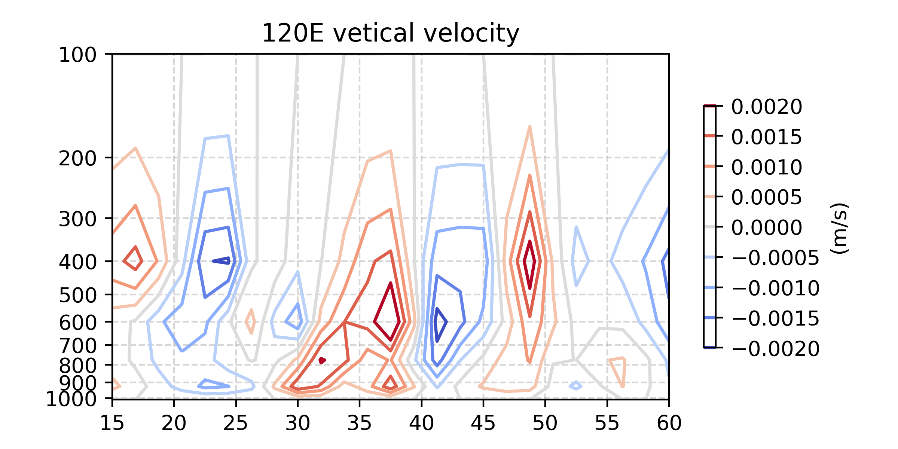

# 1121 天氣學與天氣分析（下） --- 作業二

> - 姓名：林群賀
> - 系級：大氣四
> - 學號：109601003

## 執行程式碼
```shell
$ python3 main.py
```

## 垂直速度剖面圖

| 只有分成 10 等分 | 看出所有垂直速度 |
|:-:|:-:|
|  |  |

## 問題討論：
### 1. 為何垂直速度要用計算的？計算出來後用途為何？

### 2. 此計算方法有何優缺點？

### 3. 其他計算垂直速度的方法及其優缺點？ 
