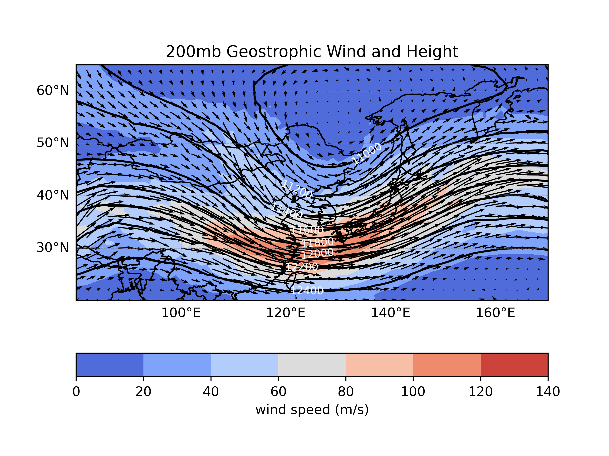
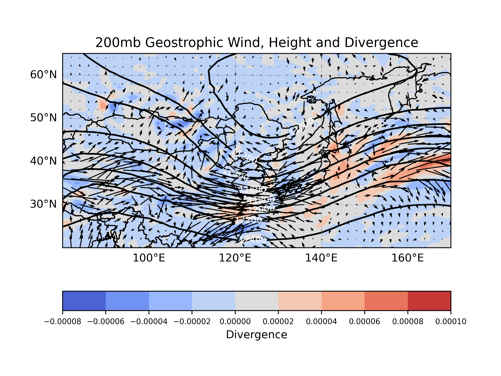
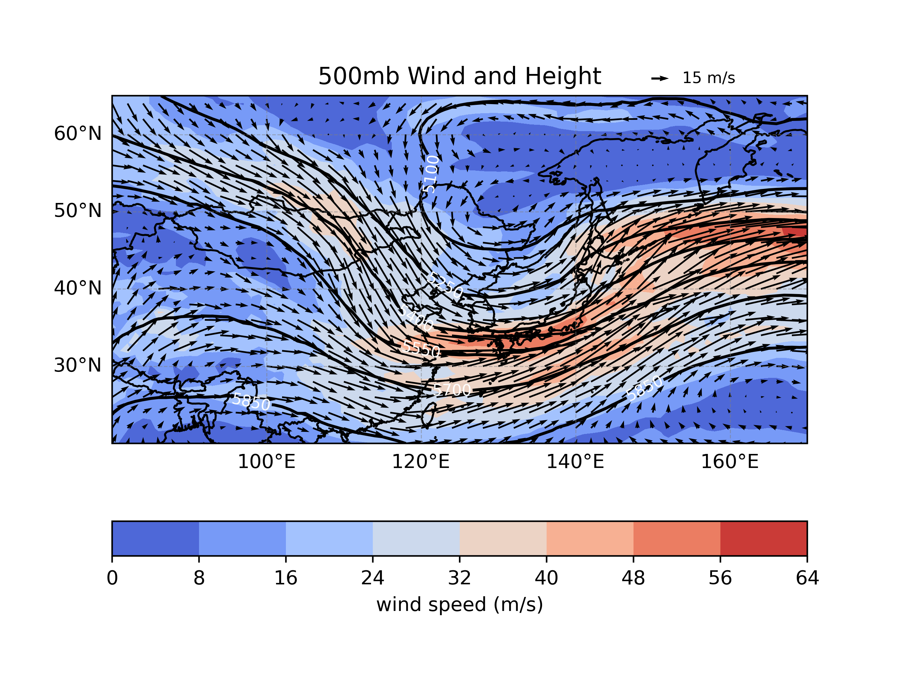
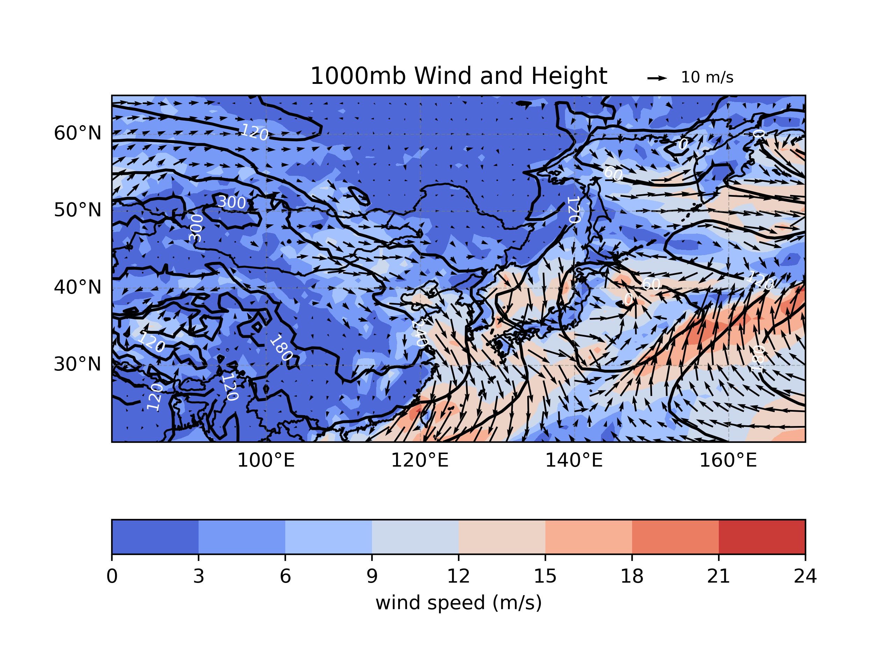

# 1121 天氣學與天氣分析（下） --- 作業三

> - 姓名：林群賀
> - 系級：大氣四
> - 學號：109601003

## 執行程式碼
```shell
$ python3 main.py
```

| 200 hPa 地轉風與重力位高度場 | 200 hPa 非地轉風 & 輻合輻散與重力位高度場 |
| :---: | :---: |
|  |  |

| 500 hPa 風場與重力位高度場 (標示槽脊線) | 1000 hPa 風場與高度場 (需附加地面系統標示) |
| :---: | :---: |
|  |  |


